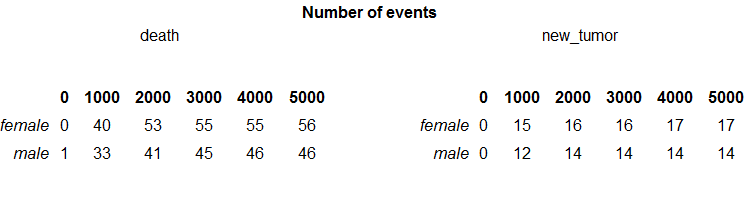
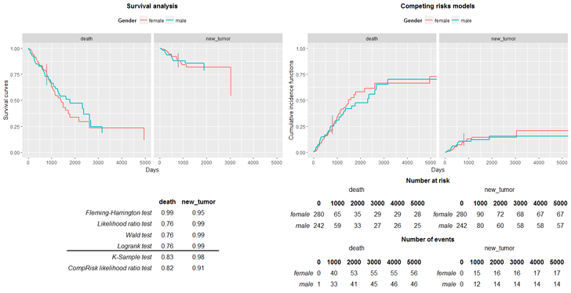

<style>
body {
text-align: justify}
</style>


```{r, include = FALSE}
knitr::opts_chunk$set(collapse = TRUE, warning = FALSE, message = FALSE,
                      fig.height = 5, fig.width = 10,
                      dpi = 200)

library(knitr)
library(cr17)
library(dplyr)
```

#Introduction
Package cr17 provides an user-friendly tool for testing differences between groups in competing risks models. It also enables generating a summarized report by using just one function **summarizeCR**.


Competing risks models examine the time $T$ to the first occurrence of an event (we refer to an event also as a 'risk'). As opposed to survival analysis we consider more then one, independent types of events, denoted $j \in \{1,2,...,J\}$ that can occur to each subject. If the event doesn't happen to a subject, we treat it as *censored* and we record the time to the last follow-up. To illustrate that lets have a look at sample data:

```{r, echo = FALSE}
sampleTable <- data.frame('Patient' = numeric(5),
                          'Time' = numeric(5),
                          'Status' = numeric(5))

sampleTable$Patient <- 1:5
sampleTable$Time <- c(5,1,4,5,2)
sampleTable$Status <- c(1,0,1,2,2)

kable(sampleTable)
```

The column *Patient* indicates the id of a patient, the column *Time* indicates time from the beginning of observation to the first event or last follow-up and the column *Status* indicates the type of an event (0 means that the observation is censored). Having this type of data we would like to model expected duration of time until given type of the event happens. What's more, using the package cr17, we can examine if the models differ between groups. This type of analysis is crucial in testing efficiency of different types of medical therapies. It can be also applied to many other situations, for example studying time to the first malfunction of a machine (where the group variable can be the condition, the machine was used in, e.g. ambient temperature).

In the package there are implementations of 4 methods for modelling competing risks and 2 plotting functions.

#Data 
Data attached to the package comes from The Cancer Genome Atlas Project and describes survival times of 522 patients with lung cancer. It contains following columns:

- **time** is a time in days from the beginning of an observation to an event or last follow-up,
- **event** is a type of event that have happened ("death", "new_tumor" or "alive" when the observation was censored),
- **gender** is a gender of a patient (grouping variable).

#Survival curves estimation

The first approach is to estimate survival curves for each risk separately treating an occurrance of the other event type as censoring. The survival function is a probability of surviving up to a given time. Formally:

$$S(t) = \mathbf{P}(t<T)$$

There are 2 basic estimators of survival curves:


1. **Kaplan-Meier estimator:**
$$\hat{S}_{km}(t) = \prod_{t_i \leq t} (1-\hat{q_{i}}) =  \prod_{t_i \leq t} \left(1 - \frac{d_{i}}{n_{i}}\right)$$
2. **Flemming-Harrington estimator:**
$$\hat{S}_{fh}(t) = \exp(-\hat{H}_{fh} (t))$$
where:
$$\hat{H}_{fh} (t) = \sum_{i: t_{i} \leq t} \frac{d_i}{r_i}$$

The package cr17 contains **fitSurvival** function that computes estimations of survival curves for each risk in each group. The arguments of the function are:
 
* **time** - vector with times of the first event or last follow-up, must be numeric,
* **risk** - vector with type of event, can be numeric or factor/character,
* **group** - vector with group variable, can be numeric or factor/character,
* **cens** - value of 'risk' indicating censored observation (if NULL, the first value of 'risk' vector will be taken),
* **type** - type of survival curve to be fitted. Possible values are "kaplan-meier" (default), "fleming-harrington" or "fh2" (the variation of Flemming Harrington estimator),
* **conf.int** - level of two-sided confidence interval (default = 0.95),
* **conf.type**	- type of confidence interval. Possible values: "none", "plain", "log" (default), "log-log",

Basic usage:
```{r}
survivalCurves <- fitSurvival(time = LUAD$time,
                              risk = LUAD$event, 
                              group = LUAD$gender,
                              cens = "alive")
```

survivalCurves is now a list of two elements of class summary.survfit [1], corresponding to each risk:
```{r}
names(survivalCurves)
```

Each element of a list contains estimation of survival curves for given risk in each group. We can extract the estimation of survival curve for a given risk and group:
```{r}
SC <- survivalCurves$death[c("time", 
                       "n.risk", 
                       "n.event", 
                       "n.censor", 
                       "surv", 
                       "strata",
                       "std.err",
                       "lower",
                       "upper")]

SC <- as.data.frame(SC)
SC <- filter(SC, strata == "male")

kable(head(SC, n = 10))
```

Survival curves can be plotted by using the **plotSurvival** function. The **target** argument allows to plot a confidence interval in a given point in time. It is possible to choose the ggplot theme of a plot (**ggtheme** argument) as well as title of a plot (**titleSurv**), axis (**xtitle**, **ytitle**) and of a legend (**legentitle**).

```{r, out.width=700, fig.align='center'}
plotSurvival(fit = survivalCurves,
             target = 1500,
             ggtheme = theme_gray(),
             legendtitle = "Gender")
```

Now, to test differences between groups in models, using **Flemming-Harrington Test** [1], one can use the **testSurvival** function. By choosing the parameter **rho** to be 0, we get the result of a log-rank test:

```{r}
testSurvival(time = LUAD$time, 
             risk = LUAD$event, 
             group = LUAD$gender, 
             cens = "alive", 
             rho = 0)
```

#Cox models
The other approach of modelling survival analysis is to use so called Cox models. Again, we can use it in case of competing risks by creating a model for each type of event separately, treating other events as censoring. 
To understand the idea behind the Cox models, we need to know the definition of hazard function:
$$h(t) = lim_{\epsilon \to 0} \frac{\mathbf{P}(t<T<t+\epsilon|T>t)}{\epsilon}$$

Cox model assumes following form of a hazard function:
$$h_1(t, z_1, z_2,...,z_m) = h_0(t) e^{\beta_1z_1 + \beta_2z_2 +...+ \beta_mz_m}$$
where:

- $h_0$ is a baseline hazard function (not specified),
- $z_1,z_2,...,z_m$ are the time independent predictors,
- $\beta_1,\beta_2,...,\beta_m$ are parameters.

Estimation of Cox models for each risk separately can be done by **fitCox** function.
```{r}
coxModel <- fitCox(time = LUAD$time,
              risk = LUAD$event,
              group = LUAD$gender,
              cens = "alive",
              conf.int = 0.95)
```

The result of the function is a list, which elements are objects of class summary.coxph [1] for each risk.

```{r}
names(coxModel)
```

We can extract the estimated parameteres of the models:
```{r}
coxModel$death$coefficients
```

Testing differences between groups can be done with the **testCox** function:
```{r}
kable(testCox(fitCox = coxModel))
```

#Cumulative incidence function
Cumulative incidence function is the probability of surviving up to time $t$, if the first event is of type $j$:
$$F_{j}(t) = \mathbf{P}(T \leq t, \delta = j) = \int_0^t h_{j}(u)S(u)du, \ \ \ j \in \{1,2,3,...,J\},$$
where $\delta$ is a type of an event. Estimation of this function we obtain with function **fitCuminc**:
```{r}
cuminc <- fitCuminc(time = LUAD$time,
                    risk = LUAD$event,
                    group = LUAD$gender,
                    cens = "alive")
```

The object 'cuminc' is now a list containing 5 elements, where first 4 are the estimations of the  cumulative incidence function for each combination of a risk and a group. The last element of a list is a result of a K-sample test [2]:

```{r}
names(cuminc)
```

```{r}
femaleDeathCuminc <- cuminc[["female death"]]

femaleDeathCuminc <- as.data.frame(femaleDeathCuminc)

kable(head(femaleDeathCuminc))
```

We obtain plots of cumulative incidence curves by using the **plotCuminc** function. Again, we can choose a point in time, at which the confidence intervals will be plotted. We can also adjust the title of the plot, of the axes and of the legend:
```{r, out.width=700, fig.align='center'}
plotCuminc(ci = cuminc,
           cens = "alive",
           target = 1500,
           ggtheme = theme_gray(),
           legendtitle = "Gender")

```
P-values of K-sample test can be extracted by **testCuminc** function:
```{r}
testCuminc(cuminc) 
```

#Cox models for competing risks
The last approach offered by a cr17 package is to use the Cox models for competing risks. The hazard function is now:
$$h_j(t) = h_{j0}(t) \exp(Z^{\mathbf{T}}\beta_0),$$
where $h_{jo}$ is the baseline hazard function for risk $j$. Estimation of this function can be obtained by **fitReg** function:
```{r}
reg <- fitReg(time = LUAD$time,
              risk = LUAD$event,
              group = LUAD$gender,
              cens = "alive")
```

The result is a list of length two with estimations of Cox models for competing risks for each type of event. Analogously as in case of **fitCox** function we can obtain coefficients:
```{r}
reg$death$coef
```
and we can test the differences between groups with modified likelihood ratio test:
```{r}
testReg(reg)
```

#Diagnostic tables
The package contains two functions returning diagnostic tables. A result of **riskTab** function is a table with number of subjects at risk in given groups, and a result of **eventTab** function is a table with number of events that have happened up to the given time points. 
```{r, eval=FALSE}
riskTab(time = LUAD$time,
        risk = LUAD$event,
        group = LUAD$gender,
        cens = "alive",
        title = "Number at risk")

```


```{r, eval=FALSE}
eventTab(time = LUAD$time,
        risk = LUAD$event,
        group = LUAD$gender,
        cens = "alive",
        title = "Number of events")

```


#summarizeCR function
To simplify the way of using a package we created function **summarizeCR** that gather results of all functions described above in a one-page report. Basic usage:

```{r, eval = FALSE}
summarizeCR(time = LUAD$time, 
            risk = LUAD$event, 
            group = LUAD$gender, cens = "alive")
```


The report consists of 3 parts. In the upper part, there are plots of survival and cumulative incidence function. In the lower part, on the left hand side we see p-values of tests examining differences in models between groups. The bold line separates the test for survival analysis and for competing risks models. On the right hand, side we see tables with number at risks and number of events.

The report can be rearranged in few ways. First of all, adding the parameter **target**, the confindence intervals can be plotted. Secondly, we can choose the theme of the plots (argument **ggtheme**). And finaly, we can rename plots, axis, legends and tables.

```{r, eval = FALSE}
summarizeCR(time = LUAD$time, 
            risk = LUAD$event, 
            group = LUAD$gender, 
            cens = "alive", 
            rho = 1, 
            target = 800, 
            type = "kaplan-meier", 
            ggtheme = theme_gray(), 
            titleSurv = "Survival analysis", 
            titleCuminc = "Competing risks models", 
            xtitle = "Days", 
            ytitleSurv = "Survival curves", 
            ytitleCuminc = "Cumulative incidence functions", 
            legendtitle = "Gender")
```


#Summary
The package cr17 provides multiple methods for analysing competing risks data. It enables estimations of models, diagnostic plots and tables as well as results of tests examining differences in models between groups. 


#Bibliography

* Therneau T (2015). _A Package for Survival Analysis in S_. version
2.38, 
<URL: https://CRAN.R-project.org/package=survival>.
Terry M. Therneau and Patricia M. Grambsch (2000). _Modeling Survival
Data: Extending the Cox Model_. Springer, New York. ISBN
0-387-98784-3.

* Bob Gray (2014). cmprsk: Subdistribution Analysis of Competing
Risks. R package version 2.2-7.
https://CRAN.R-project.org/package=cmprsk
